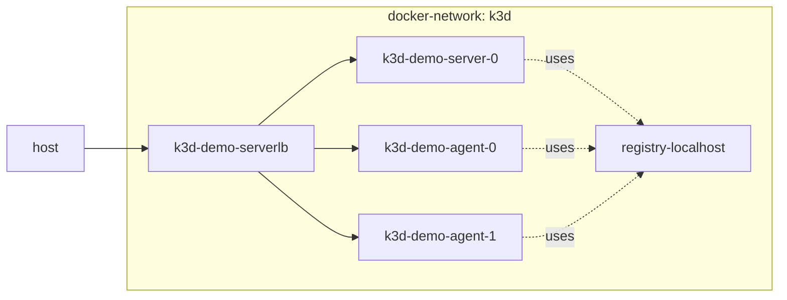

# k3d-playground
Just messing around with k3d

# Arch

This repo will create a multi-node `k3s` cluster using `k3d` command-line inside a separate docker network and can add a private docker registry to push docker images. (also see: https://github.com/bravecobra/k8s-dev-infrastructure/blob/adb085443cffb00a69c2ddc4a415f02ef785d79a/docs/clusters/k3s.md?plain=1)



Linux and macOS script to create a k3d (k3s in docker) cluster for development
including:

- [Cert Manager](https://github.com/cert-manager/cert-manager) provision and manage TLS certificates in Kubernetes
- [Cilium](https://github.com/cilium/cilium) eBPF-based networking, security, and observability
- [Grafana](https://github.com/grafana/grafana) visualize metrics, logs, and traces
- [Ingress-NGINX](https://github.com/kubernetes/ingress-nginx) ingress controller for Kubernetes using NGINX
- [Kubernetes Dashboard](https://github.com/kubernetes/dashboard) general-purpose web UI for Kubernetes
- [Loki](https://github.com/grafana/loki) log aggregation system
- [MetalLB](https://github.com/metallb/metallb) network load-balancer implementation
- [OpenFaaS](https://github.com/openfaas/faas) serverless functions made simple
- [Prometheus](https://github.com/prometheus/prometheus) monitoring system and time series database
- [Audit2rbac](https://github.com/liggitt/audit2rbac) create proper rbac from audit logs
- [gitea](https://gitea.com) Self-hosted Git service
- [Kanidm](https://kanidm.com) Modern and simple identity management platform
- [ntfy](https://ntfy.sh) Notification service to send notifications to your phone or desktop
- [Renovate](https://www.whitesourcesoftware.com/free-developer-tools/renovate) Automatically update dependencies
- [Woodpecker CI](https://woodpecker-ci.org) Simple yet powerful CI/CD engine with great extensibility
- [Gatus](https://gatus.io/) The automated status page that you deserve. If your infrastructure went down right now, how long would it take for you to know? (see https://github.com/onedr0p/home-ops/blob/main/kubernetes/main/apps/observability/gatus/app/helmrelease.yaml)
- node-feature-discovery
- [synology-csi](https://github.com/SynologyOpenSource/synology-csi): The official Container Storage Interface driver for Synology NAS. (https://github.com/JefeDavis/k8s-HomeOps/blob/main/README.md?plain=1)
- [sops](https://toolkit.fluxcd.io/guides/mozilla-sops/): Managed secrets for Kubernetes, Ansible and Terraform which are commited to Git.
- [system-upgrade-controller](https://github.com/rancher/system-upgrade-controller) Automatically updates kubernetes based off of a plan.
- [actions-runner-controller](https://github.com/actions/actions-runner-controller): Self-hosted Github runners.
- [external-dns](https://github.com/kubernetes-sigs/external-dns): Automatically manages DNS records for my cluster.
- [metallb](https://metallb.universe.tf/): Bare-Metal Load-balancer
- [Goldilocks](https://github.com/billimek/k8s-gitops/tree/8f5ff27df2673dbf442c3eee429f51b3b9b15256/default): Goldilocks: An Open Source Tool for Recommending Resource Requests
- [coredns](https://coredns.github.io/helm): also see https://github.com/billimek/k8s-gitops/blob/master/networking/coredns/coredns.yaml

## Requirements

A working `docker` installation is required. Additional tooling will be downloaded automatically if they are not
available: `helm`, `k3d` and `kubectl`.

### macOS notes

Docker Desktop for Mac does not support routing to containers by IP address meaning that cluster nodes and load balancer
addresses cannot be accessed directly. This functionality is supported natively by Linux and requires additional tooling
on macOS. One such utility is [docker-mac-net-connect](https://github.com/chipmk/docker-mac-net-connect) which can be
installed via [homebrew](https://brew.sh/):

```sh
brew install chipmk/tap/docker-mac-net-connect
brew services start chipmk/tap/docker-mac-net-connect
```


### Example traefik labels

```
    labels:
      - "traefik.enable=true"
      - "traefik.http.routers.minio-http.rule=Host(`minio.scarlettlab.home`)"
      - "traefik.http.routers.minio-http.entrypoints=web"
      - "traefik.http.routers.minio-http.service=minio-http"
      - "traefik.http.services.minio-http.loadbalancer.server.port=9000"
      - "traefik.port=9000"
```


```
# SOURCE: https://doc.traefik.io/traefik/getting-started/install-traefik/#use-the-helm-chart
# dashboard.yaml
apiVersion: traefik.io/v1alpha1
kind: IngressRoute
metadata:
  name: dashboard
spec:
  entryPoints:
    - web
  routes:
    - match: Host(`traefik.localhost`) && (PathPrefix(`/dashboard`) || PathPrefix(`/api`))
      kind: Rule
      services:
        - name: api@internal
          kind: TraefikService
```


# Query to use when you get to grafana

```
{job="vector"} | json | line_format "{{.message}}" |= ``
```


## Resources versioning

```bash
- Kubernetes Version: v1.27.4-k3s1
- ArgoCD Version: v2.8.9
- k3d tested using v5.6 with v1alpha5 config file
```
### Avaliable Kubernetes services:

> - [ArgoCD][argocd-url] as the main GitOps tool | **Available at [argocd.k8s.localhost][argocd-localhost]**
> - Access to the cluster using [Nginx Ingress][nginx-url].
> - On-demand databases clusters with [Zalando Operator for PostgreSQL][postgres-url] | **UI available at [dbs.k8s.localhost][dbs-localhost]**
> - Hot-Reload secrets and configmaps to pods using [Reloader][reloader-url].
> - Mirror resources between namespaces using [Reflector][reflector-url].

### Tools required locally

> - [k3d][k3d-url] running atop of either (pick one):
>   - [Rancher Desktop **(Recommended)**][rancher-url]
>   - [Docker for Desktop][docker-url]
>   - [Podman][podman-url] (works but [requires extra steps][podman-steps])
> - [Task][task-url] as a more modern iteration of the Makefile utility
> - [mkcert][mkcert-url] for creating locally based TLS certificates for your ingress proxy
> - [kubectl][kubectl-url] | [kustomize][kustomize-url] | [helm][helm-url] to apply local commands to the cluster
> - [jq][jq-url] to manipulate the resulting JSON files and extract the required strings
> - [hostctl][hostctl-url] to create the local domain on your hosts file *(optional, but recommended)*

### In case you want to reset the environment

Whenever you want to restart from scratch and create a new cluster, just type `task` again.

<!---
> - Metrics monitoring with [Prometheus's Stack][prometheus-url] (Also includes [Grafana][grafana-url])
-->
<!--- References --->
[tls-uri]: https://github.com/gruberdev/local-gitops/tree/main/config/tls
[storage-uri]: https://github.com/gruberdev/local-gitops/tree/main/storage
[argocd-url]: https://argo-cd.readthedocs.io/en/stable/
[nginx-url]: https://github.com/kubernetes/ingress-nginx
[vault-url]: https://github.com/hashicorp/vault
[vault-plugin-url]: https://github.com/argoproj-labs/argocd-vault-plugin
[postgres-url]: https://github.com/zalando/postgres-operator
[reloader-url]: https://github.com/stakater/Reloader
[prometheus-url]: https://github.com/prometheus-operator/kube-prometheus
[grafana-url]: https://github.com/grafana/grafana
[kube-cleanup-url]: https://github.com/lwolf/kube-cleanup-operator
[reflector-url]: https://github.com/emberstack/kubernetes-reflector
[kubefledged-url]: https://github.com/senthilrch/kube-fledged
[descheduler-url]: https://github.com/kubernetes-sigs/descheduler
[kwatch-url]: https://github.com/abahmed/kwatch
[botkube-url]: https://github.com/infracloudio/botkube
[kubenurse-url]: https://github.com/postfinance/kubenurse
[longhorn-url]: https://longhorn.io/
[longhorn-issue]: https://github.com/rancher/k3d/discussions/478
[velero-url]: https://velero.io/
[velero-list-url]: https://velero.io/docs/v1.7/supported-providers/
[kube-dump-url]: https://github.com/WoozyMasta/kube-dump
[stash-url]: https://stash.run/
[task-url]: https://taskfile.dev
[task-installation-url]: https://taskfile.dev/installation/
[mkcert-url]: https://github.com/FiloSottile/mkcert
[kubectl-url]: https://kubernetes.io/docs/tasks/tools/
[jq-url]: https://stedolan.github.io/jq/download/
[k3d-url]: https://k3d.io
[docker-url]: https://www.docker.com/products/docker-desktop/
[rancher-url]: https://rancherdesktop.io/
[podman-url]: https://podman.io/
[podman-steps]: https://k3d.io/v5.6.0/usage/advanced/podman/
[hostctl-url]: https://github.com/guumaster/hostctl
[kustomize-url]: https://kubectl.docs.kubernetes.io/installation/kustomize/
[helm-url]: https://helm.sh/docs/intro/install/
[chocolate-url]: https://chocolatey.org/install
[brew-url]: https://brew.sh/

<!--- Local URIs --->
[argocd-localhost]: https://argocd.k8s.localhost
[vault-localhost]: https://vault.k8s.localhost
[dbs-localhost]: https://dbs.k8s.localhost


# k3d-pv.yaml and k3d-pvc.yaml

```
# SOURCE: https://blogops.mixinet.net/posts/k8s_static_content_server/
apiVersion: v1
kind: PersistentVolume
metadata:
  name: scs-pv
  labels:
    app.kubernetes.io/name: scs
spec:
  capacity:
    storage: 8Gi
  volumeMode: Filesystem
  accessModes:
  - ReadWriteOnce
  persistentVolumeReclaimPolicy: Delete
  claimRef:
    name: scs-pvc
  storageClassName: local-storage
  local:
    path: /volumes/scs-pv
  nodeAffinity:
    required:
      nodeSelectorTerms:
      - matchExpressions:
        - key: node.kubernetes.io/instance-type
          operator: In
          values:
          - k3s
# The nodeAffinity section is required but in practice the current definition selects all k3d nodes.
---
apiVersion: v1
kind: PersistentVolumeClaim
metadata:
  name: scs-pvc
  labels:
    app.kubernetes.io/name: scs
spec:
  accessModes:
  - ReadWriteOnce
  resources:
    requests:
      storage: 8Gi
  storageClassName: local-storage
```


# :cloud: Cloud services

While most of my infrastructure and workloads are selfhosted I do rely upon the cloud for certain key parts of my setup. This saves me from having to worry about two things. (1) Dealing with chicken/egg scenarios and (2) services I critically need whether my cluster is online or not.

The alternative solution to these two problems would be to host a Kubernetes cluster in the cloud and deploy applications like [HCVault](https://www.vaultproject.io/), [Vaultwarden](https://github.com/dani-garcia/vaultwarden), [ntfy](https://ntfy.sh/), and [Authentik](https://https://goauthentik.io/). However, maintaining another cluster and monitoring another group of workloads is a lot more time and effort than I am willing to put in and only saves me roughly $10/month.

| Service                                      | Use                                                            | Cost          |
| -------------------------------------------- | -------------------------------------------------------------- | ------------- |
| [GitHub](https://github.com/)                | Hosting this repository and continuous integration/deployments | Free          |
| [Auth0](https://auth0.com/)                  | Identity management and authentication                         | Free          |
| [Cloudflare](https://www.cloudflare.com/)    | Domain, DNS and proxy management                               | Free          |
| [1Password](https://1password.com/)          | Secrets with [External Secrets](https://external-secrets.io/)  | ~$65/y        |
| [Terraform Cloud](https://www.terraform.io/) | Storing Terraform state                                        | Free          |
| [B2 Storage](https://www.backblaze.com/b2)   | Offsite application backups                                    | ~$5/m         |
| [Pushover](https://pushover.net/)            | Kubernetes Alerts and application notifications                | Free          |
|                                              |                                                                | Total: ~$10/m |


# Utilization

```
❯ k top pods --sort-by=cpu --no-headers --all-namespaces
argocd          argocd-application-controller-0                                1286m   558Mi
identity        authentik-worker-76f546f977-g6d95                              465m    352Mi
monitoring      prometheus-kube-prometheus-stack-prometheus-0                  253m    657Mi
argocd          argocd-repo-server-767b85c9d7-qnn7q                            186m    80Mi
databases       postgres-1                                                     146m    108Mi
monitoring      kube-prometheus-stack-grafana-66cb4d9789-rkjdc                 102m    164Mi
databases       postgres-2                                                     72m     96Mi
argo-rollouts   argo-rollouts-7fbfc86cd4-klv2c                                 60m     28Mi
identity        authentik-server-778dd5d77d-5p8px                              32m     406Mi
kube-system     coredns-77ccd57875-85cbj                                       24m     26Mi
monitoring      kube-prometheus-stack-prometheus-node-exporter-zgmkc           20m     10Mi
identity        authentik-redis-master-0                                       19m     5Mi
monitoring      kube-prometheus-stack-prometheus-node-exporter-467d4           18m     10Mi
databases       cloudnative-pg-7697b57c65-2lmfm                                17m     37Mi
monitoring      goldilocks-vpa-recommender-7b954b7f64-7mnmj                    16m     29Mi
monitoring      kube-prometheus-stack-prometheus-node-exporter-p6jxc           14m     17Mi
monitoring      kube-prometheus-stack-prometheus-node-exporter-lp4hs           13m     11Mi
kube-system     ingress-nginx-controller-65d894d56f-h8vmv                      9m      119Mi
monitoring      k8s-ephemeral-storage-metrics-8d6647899-9pkdx                  9m      23Mi
argocd          argocd-server-8576b5f9b7-cxvf4                                 9m      44Mi
monitoring      kube-prometheus-stack-operator-66b7d5c8c7-954xx                9m      28Mi
kube-system     metrics-server-7fcfb9bf84-xzxfn                                9m      18Mi
kube-system     metrics-server-7fcfb9bf84-bb44m                                9m      21Mi
argocd          argocd-notifications-controller-6b8bbcb69d-sxn6v               8m      41Mi
argocd          argocd-redis-6d65848d4d-jtptw                                  8m      12Mi
monitoring      alertmanager-kube-prometheus-stack-alertmanager-0              8m      33Mi
monitoring      kube-prometheus-stack-kube-state-metrics-755c5bd944-fg7hk      8m      19Mi
monitoring      prometheus-adapter-7d9d445c94-7svvc                            7m      17Mi
monitoring      kubernetes-dashboard-metrics-server-d97d78f7b-l6ngw            7m      17Mi
argocd          argocd-applicationset-controller-7779665c97-fhqzk              6m      29Mi
monitoring      goldilocks-vpa-updater-56584b75f7-8n29r                        5m      24Mi
kube-system     external-secrets-5477599d89-sg8h4                              5m      25Mi
development     podinfo-664f9748d8-kb5bw                                       5m      15Mi
monitoring      thanos-query-7c69ff459b-hhnlw                                  5m      18Mi
kube-system     onepassword-connect-575bc6887-5n78w                            5m      14Mi
kube-system     local-path-provisioner-957fdf8bc-hgv76                         4m      7Mi
monitoring      kubernetes-dashboard-cert-manager-6d98886d86-nhszn             4m      16Mi
monitoring      goldilocks-vpa-admission-controller-595f579785-scqg5           4m      24Mi
databases       pgadmin-564b7744bb-8d6sk                                       4m      178Mi
monitoring      kubernetes-dashboard-metrics-scraper-7fb74dfddf-kxjrh          4m      11Mi
monitoring      thanos-query-frontend-6d678f5dc-7kbq7                          4m      16Mi
kube-system     reflector-5dbf465859-ntm8k                                     4m      24Mi
monitoring      kube-prometheus-stack-grafana-image-renderer-7c4d8c7b8-zqb2g   4m      29Mi
monitoring      thanos-bucketweb-6879cdb767-wch26                              4m      20Mi
cert-manager    cert-manager-cainjector-c86f8699-wb4ts                         4m      26Mi
development     podinfo-664f9748d8-glxg6                                       4m      15Mi
kube-system     external-secrets-cert-controller-fd8f67b8f-cddng               4m      52Mi
cert-manager    cert-manager-558c859bb7-w8cxj                                  3m      8Mi
cert-manager    cert-manager-webhook-f8f64cb85-c6455                           3m      8Mi
monitoring      thanos-storegateway-0                                          3m      13Mi
monitoring      kubernetes-dashboard-cert-manager-webhook-6494445df6-v5q24     3m      13Mi
databases       minio-fdb7bdf77-wbbgn                                          3m      47Mi
monitoring      event-exporter-568c8d64f6-jxzz5                                3m      27Mi
monitoring      thanos-minio-74cdb5c97d-knzzx                                  3m      46Mi
kube-system     reloader-reloader-5966465cf7-phb5k                             3m      15Mi
kube-system     external-secrets-webhook-5d44cc5f5d-pgk26                      3m      20Mi
monitoring      node-problem-detector-snw6w                                    3m      17Mi
monitoring      kubeview-869c8885df-44zmq                                      3m      9Mi
monitoring      node-problem-detector-9vgqm                                    3m      18Mi
monitoring      node-problem-detector-l72vv                                    2m      15Mi
kube-system     onepassword-connect-operator-b8b885446-mvvb5                   2m      10Mi
monitoring      kubernetes-dashboard-cert-manager-cainjector-cf447686d-fbbbj   2m      45Mi
monitoring      goldilocks-controller-69bb544c8d-c8rwc                         2m      16Mi
monitoring      node-problem-detector-mlgvm                                    1m      11Mi
monitoring      goldilocks-dashboard-6d84dd7c74-wc7kz                          1m      11Mi
monitoring      kubernetes-dashboard-api-554bf5c59f-s56h4                      1m      8Mi
argocd          argocd-dex-server-77f7d7cb7c-lc6g7                             1m      17Mi
example         whoami-7bb769786d-rfntd                                        1m      1Mi
monitoring      hajimari-866b9ff956-cn8n7                                      1m      8Mi
monitoring      k8s-event-logger-8485b4cc68-zpczp                              1m      19Mi
monitoring      thanos-compactor-7f8d66dc56-tbl78                              1m      15Mi
kube-system     ingress-nginx-defaultbackend-7b67555bdc-h9wp5                  1m      4Mi
monitoring      kubernetes-dashboard-web-585d674477-w8t8v                      0m      1Mi
kube-system     svclb-kube-prometheus-stack-thanos-external-30d64f25-8q68q     0m      0Mi
kube-system     svclb-kube-prometheus-stack-thanos-external-30d64f25-6xxfg     0m      0Mi
kube-system     svclb-kube-prometheus-stack-thanos-external-30d64f25-cnhnk     0m      0Mi
kube-system     svclb-kube-prometheus-stack-thanos-external-30d64f25-swsqx     0m      0Mi
kube-system     svclb-ingress-nginx-controller-0371e36f-qzwh6                  0m      0Mi
kube-system     svclb-ingress-nginx-controller-0371e36f-bwmg5                  0m      0Mi
kube-system     svclb-ingress-nginx-controller-0371e36f-562wt                  0m      0Mi
kube-system     svclb-ingress-nginx-controller-0371e36f-92wf6                  0m      0Mi
databases       postgres-3-join-sjsdk                                          0m      9Mi

```

# k3s

https://docs.k3s.io/installation/requirements

Protocol    Port    Source  Destination Description
TCP 2379-2380   Servers Servers Required only for HA with embedded etcd
TCP 6443    Agents  Servers K3s supervisor and Kubernetes API Server
UDP 8472    All nodes   All nodes   Required only for Flannel VXLAN
TCP 10250   All nodes   All nodes   Kubelet metrics
UDP 51820   All nodes   All nodes   Required only for Flannel Wireguard with IPv4
UDP 51821   All nodes   All nodes   Required only for Flannel Wireguard with IPv6
TCP 5001    All nodes   All nodes   Required only for embedded distributed registry (Spegel)
TCP 6443    All nodes   All nodes   Required only for embedded distributed registry (Spegel)


# kine

### Flow Diagram

```mermaid
flowchart LR
  subgraph kine ["Kine"]
    subgraph grpc-server ["GRPC Server"]
      subgraph grpc-txn ["Transaction"]
        grpc-create["Create"]
        grpc-update["Update"]
        grpc-delete["Delete"]
      end
      subgraph grpc-range["Range"]
        grpc-get["Get"]
        grpc-list["List"]
      end
      subgraph grpc-watch ["Watch Stream"]
        grpc-watch-create[\"CreateRequest"/]
        grpc-watch-response[/"WatchResponse"\]
      end
    end

    subgraph logstructured ["LogStructured"]
      logstructured-get("Get")
      logstructured-list("List")
      logstructured-create("Create")
      logstructured-update("Update")
      logstructured-delete("Delete")
      logstructured-watch("Watch")
    end

    subgraph sqllog ["SQLLog"]
      sqllog-append("Append")
      sqllog-list("List")
      sqllog-watch("Watch")
      sqllog-after("After")
      subgraph sqllog-poll ["Poll Loop"]
        sqllog-poll-timer("Timer")
        sqllog-poll-select("Select")
        sqllog-poll-events("Rows to Events")
      end
      subgraph broadcaster ["Broadcaster"]
        broadcaster-subscribe("Subscribe")
      end
    end
  end

  subgraph clients ["Clients"]
    kube-apiserver((("apiserver")))
    etcdctl((("etcdctl")))
  end

  subgraph database ["Database"]
    direction LR
    database-table[["table"]]
  end

  grpc-server --- clients
  sqllog ~~~~~~~~~~~~ database

  grpc-watch-create == "start" ===> logstructured-watch == "revision" ===> sqllog-watch == "prefix" ===> broadcaster-subscribe
  grpc-create --> logstructured-create --> sqllog-append
  grpc-update --> logstructured-update --> sqllog-append
  grpc-delete --> logstructured-delete --> sqllog-append
  grpc-get --> logstructured-get --> sqllog-list
  grpc-list --> logstructured-list --> sqllog-list

  sqllog-list -- "list query" ---------- database-table
  sqllog-append -- "insert returning revision" --- database-table
  sqllog-append -- "1a: notify revision" --> sqllog-poll-select
  sqllog-poll-timer -. "1b: tick" ..-> sqllog-poll-select
  sqllog-poll-select -."2: latest revision" ..-> sqllog-after -. "after query" ..- database-table
  sqllog-poll-select -. "3: []row" .-> sqllog-poll-events

  sqllog-poll-events -. "4 chan []event" .-> broadcaster-subscribe
  broadcaster-subscribe == "chan []event 100<br>prefix filter" ==> sqllog-watch
  logstructured-watch == "start revision" ==> sqllog-after == "after query" === database-table
  sqllog-watch == "chan []event 100<br>revision filter" ===> logstructured-watch
  logstructured-watch == "chan []event 100<br>batching" ===> grpc-watch-response

  click grpc-create href "https://github.com/k3s-io/kine/blob/master/pkg/server/create.go" _blank
  click grpc-update href "https://github.com/k3s-io/kine/blob/master/pkg/server/update.go" _blank
  click grpc-delete href "https://github.com/k3s-io/kine/blob/master/pkg/server/delete.go" _blank
  click grpc-get href "https://github.com/k3s-io/kine/blob/master/pkg/server/get.go" _blank
  click grpc-list href "https://github.com/k3s-io/kine/blob/master/pkg/server/list.go" _blank
  click grpc-watch-create href "https://github.com/k3s-io/kine/blob/master/pkg/server/watch.go#L70" _blank
  click grpc-watch-response href "https://github.com/k3s-io/kine/blob/master/pkg/server/watch.go#L119" _blank

  click logstructured-create href "https://github.com/k3s-io/kine/blob/master/pkg/logstructured/logstructured.go#L97" _blank
  click logstructured-update href "https://github.com/k3s-io/kine/blob/master/pkg/logstructured/logstructured.go#L222" _blank
  click logstructured-delete href "https://github.com/k3s-io/kine/blob/master/pkg/logstructured/logstructured.go#L129" _blank
  click logstructured-get href "https://github.com/k3s-io/kine/blob/master/pkg/logstructured/logstructured.go#L60" _blank
  click logstructured-list href "https://github.com/k3s-io/kine/blob/master/pkg/logstructured/logstructured.go#L171" _blank
  click logstructured-watch href "https://github.com/k3s-io/kine/blob/master/pkg/logstructured/logstructured.go#L432" _blank

  click sqllog-list href "https://github.com/k3s-io/kine/blob/master/pkg/logstructured/sqllog/sql.go#L274" _blank
  click sqllog-append href "https://github.com/k3s-io/kine/blob/master/pkg/logstructured/sqllog/sql.go#L529" _blank
  click sqllog-poll-select href "https://github.com/k3s-io/kine/blob/master/pkg/logstructured/sqllog/sql.go#L353" _blank
  click sqllog-poll-events href "https://github.com/k3s-io/kine/blob/master/pkg/logstructured/sqllog/sql.go#L402" _blank
  click sqllog-watch href "https://github.com/k3s-io/kine/blob/master/pkg/logstructured/sqllog/sql.go#L353" _blank

  click broadcaster-subscribe href "https://github.com/k3s-io/kine/blob/master/pkg/broadcaster/broadcaster.go#L16" _blank
```


